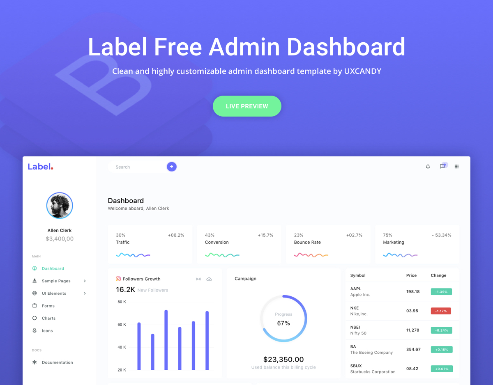

<h1>Free-Admin-Bootstrap-Template - LABEL</h1>
Label dashboard is a sophisticated responsive admin dashboard template made on top of Bootstrap 4. It is packed with highly customizable Bootstrap components that help web development easy and faster than ever with the advanced automated Gulp workflow. Almost every component is designed to minimize the loading time of the interface, and it loads faster on all devices.

Label dashboard is suitable for almost all types of projects like SAAS applications, admin panel or anything you want to build on web. Its highly custom designed plugins help developers easy to integrate into the project effortlessly. It is a well documented responsive admin dashboard template and the modular based components help developers easy to understand and maintain the beauty of the code.

<h1>Browser Support:</h1>

Label dashboard is designed to work flawlessly with all the latest and modern web browsers.

- Chrome (latest)
- FireFox (latest)
- Safari (latest)
- Opera (latest)
- IE10+

<h1>License Information:</h1>

Label dashboard is released under MIT license. Label dashboard is a free Bootstrap 4 admin template developed by uxcandy. Feel free to download it, use it, share it, get creative with it.

<h1>How to use Label Dashboard</h1>

Step 1 - Install `node-gyp` package. If you dont know installation steps, please [click here](https://github.com/nodejs/node-gyp)

Step 2 - Click the Clone or Download button in GitHub and download as a ZIP file or you can enter the command git clone https://github.com/uxcandy/Label-Free-Bootstrap-Admin-Template.git in you terminal to get a copy of this template.

Step 3 - After the files have been downloaded you will get a folder with all the required files

Step 4 - Open your terminal (Run as Administrator). You can install all the dependencies in the template by running the command npm install. All the required files are in the node modules. If you didn't run with admin authorities, you can see errors.

Step 5 - Find the file named index.html, check what all components you need. Open the file in a text editor and you can start editing.

Step 6 - Now that your project has now kick-started, all you need to do now is to code, code, and code to your heart's content.

**Note :** If you use laravel-mix, please run all command with admin authorities.

<h1>Credits:</h1>

- Bootstrap 4
- jQuery
- Popper.js
- Material Design Icons
- Gulp
- Apex Charts
- Chart.js

<h1>How to Contribute:</h1>

We love your contributions and we welcome them wholeheartedly. We believe the more the merrier.
To contribute make sure you have a Node.js and npm installed. Now run the command gulp --version. If the command returns with the Gulp version number, it means you have Gulp installed. If not you need to run the command npm install --global gulp-cli to install Gulp.

<h2>Next</h2>

After Gulp has been installed, follow the steps below to contribute.
 
Step 1 - Fork and clone the repo of "Label-Free-Bootstrap-Admin-Template".
 
Step 2 - Run the command npm install to install all the dependencies.
 
Step 3 - Enter the command gulp serve. This will open Label dashboard in your default browser.
 
Step 4 - Make you valuable contribution
 
Step 5 - Submit a pull request.

<h1>Go Premium!!</h1>

Do you need a template with more features and functionalities? Get more with our collection of the premium template with more plugins, eye catching animations, UI components, and sample pages all fitting together with a high-quality design,visit <a href="https://www.uxcandy.co" target="_blank">https://www.uxcandy.co</a> for more admin templates.
